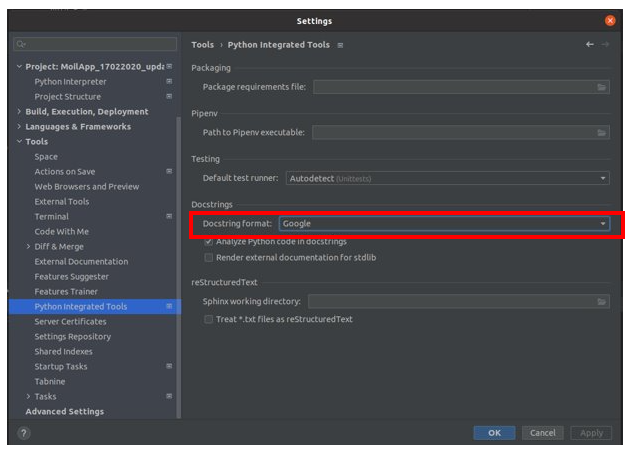
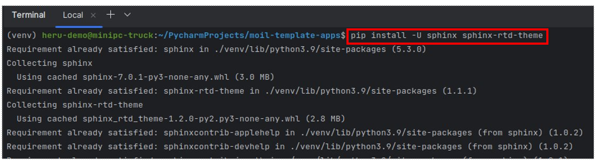
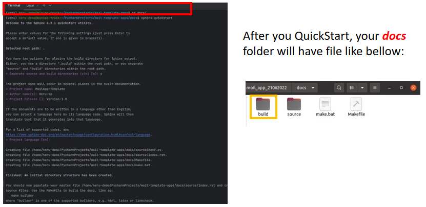
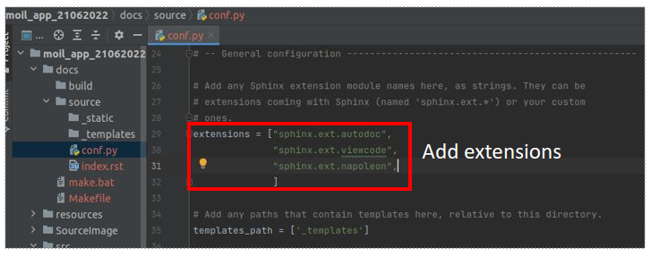
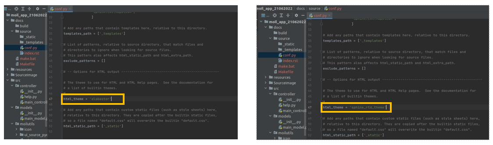
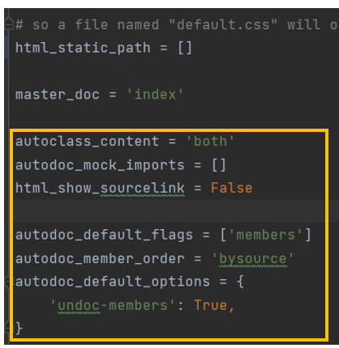
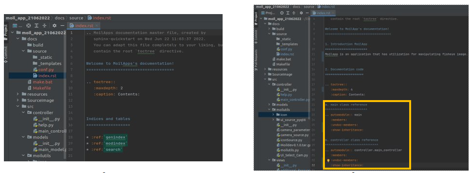
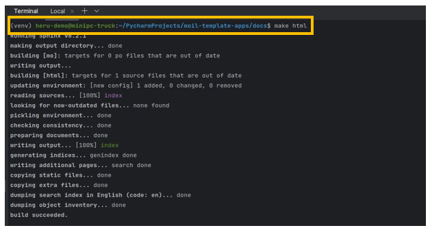
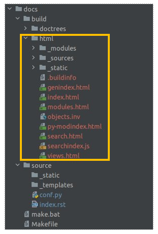

Sphinx Docs Project
###################

Pre-request
===========

- Install PyCharm IDE (optional)

- Ubuntu OS (optional)

- Make a beautiful Docstring in your code

Docsting Format
================

- We must synchronize the docstring format is use google.

- See image beside to make sure you're use the same format.

   google format

Install Sphinx
===============

Install sphinx from pypi distribution using command:

.. code-block:: bash

    $ pip install -U sphinx sphinx-rtd-theme

   sphinx-rtd-theme package

Create Docs Folder
==================

You have to create docs folder inside your project directory.

.. code-block:: bash

    $ mkdir docs

Change working directory to "docs" folder

.. code-block:: bash

    $ cd docs

Getting started

.. code-block:: bash

    $ sphinx-quickstart

   command create sphinx-quickstart

   check docs directory

Configuration File
===================

.. code-block:: bash

    extensions =[
            "sphinx.ext.autodoc",
            "sphinx.ext.viewcode",
            "sphinx.ext.napoleon",
            ]

You have to modify the config.py inside the folder source. Then follow the modication like shown bellow:​

.. code-block:: bash

    $ import os

    $ import sys

- Change the theme

   change the theme

- Add this configuration in the end of conf.py file:

.. code-block:: bash

    autoclass_content = 'both'

    autodoc_mock_imports = []

    html_show_sourcelink = False
    autodoc_default_flags = ['members']
    autodoc_member_order = 'bysource'
    autodoc_default_options = {
        'undoc-members': True,}

   config file

Modify index.rst file
======================

- After the configuration finish, he next is modification the index.rst file. Below is the example (modify as your requirement):​

- And then, suppose you want to generate a path for your code, you can type this command:​

   index rst file

Build the HTML
===============

Once's you finish the configuration, the you will be able to build the html pages using this command:​

.. code-block:: bash

     $ make html

     $ make clean (Revome cached)

   build documents

Open the pages
==============

The html file will be stored inside folder build/html/index.html Open it using your browser or Typing this command

.. code-block:: bash

   $ google-chrome build/html/index.html

   html pages

Convert to PDF
===============

Once you create the docs and success to build the HTML file, you also will be able to make a PDF file, the way is you just need to install the application following the command line bellow:​

.. code-block:: bash

    $ sudo apt-get install texlive-full

    $ make latexpdf

