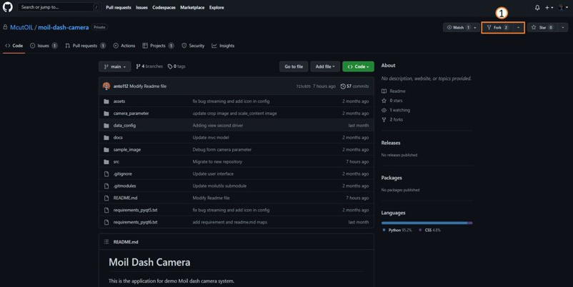
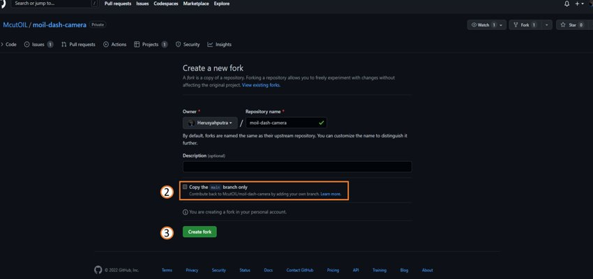
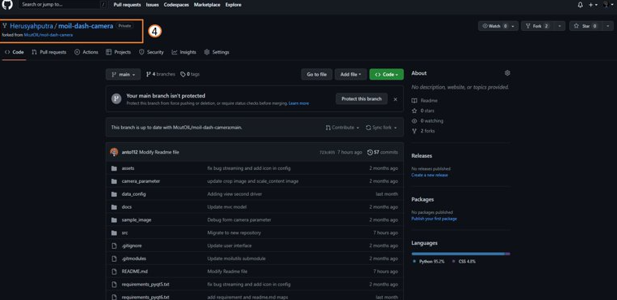
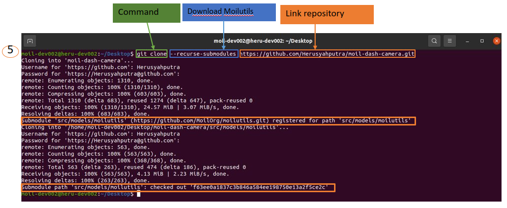
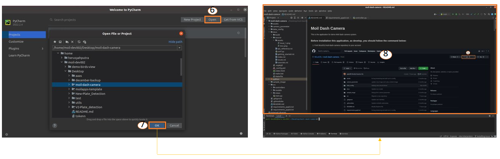
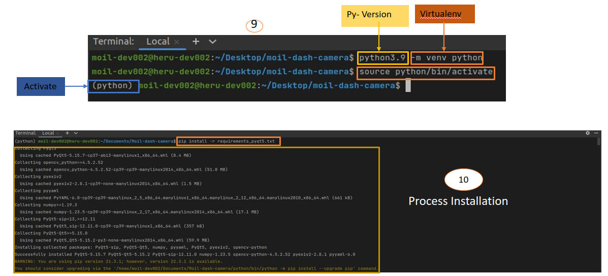
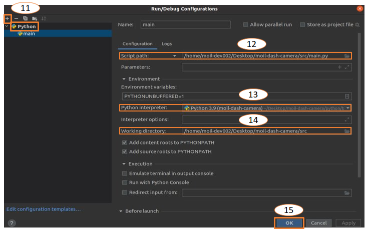
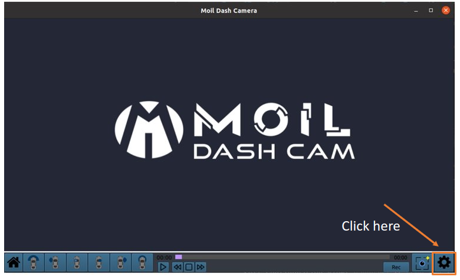
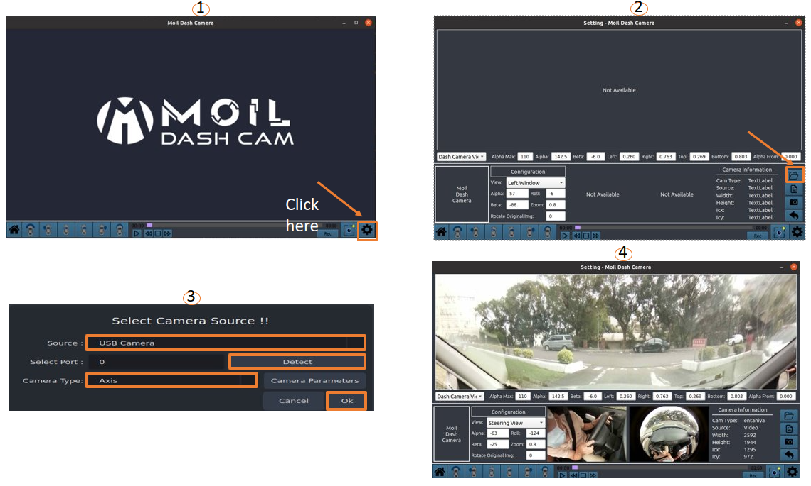

Installation Dashcam
#####################

Open McutOIL GitHub
===================

- Visit moil-dash-camera repository

- Do fork in repository to your GitHub

   Fork repository McutOIL in your computer

- Create Repository

- Uncheck the main branch only

   Create fork in your GitHub

- Program applications can be access using “Repository GitHub” below.

- This applications requirements Python 3.9 (PyQt6)

   Check your fork on your GitHub

- To run this program, please, clone the repository to your computer using command in your terminal or cmd

- git clone --recurse-submodules https://github.com/Herusyahputra/moil-dash-camera.git

   Clone repository from your GitHub on terminal

Open PyCharm
==============

- Choose open to open folder repository

- Select folder repository -> Click Ok to Open

   Open directory (repository) in PyCharm

Create Virtual Environment
===========================

follow this command for create virtualenv

   Create Virtualenv & Installation Requirements

Setting Interpreter on PyCharm
===============================

Follow this steps for setting

     - Click ikon +, to choose python

     - Choose script path on your directory

     - Choose python interpreter

     - See working directory -> Ok

   Setting Configuration interpreter on PyCharm

Run Program
============

User interface application->Select menu setting to open configuration

   showing Application

user operation
===============

   User operation apps

