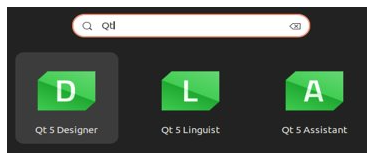
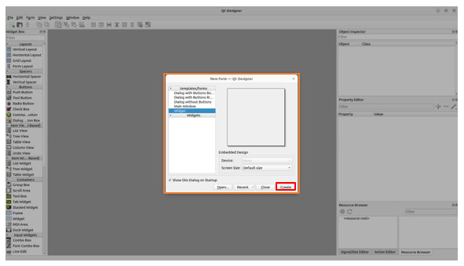
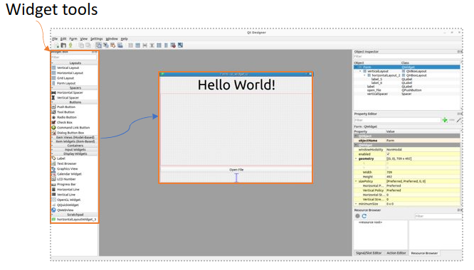
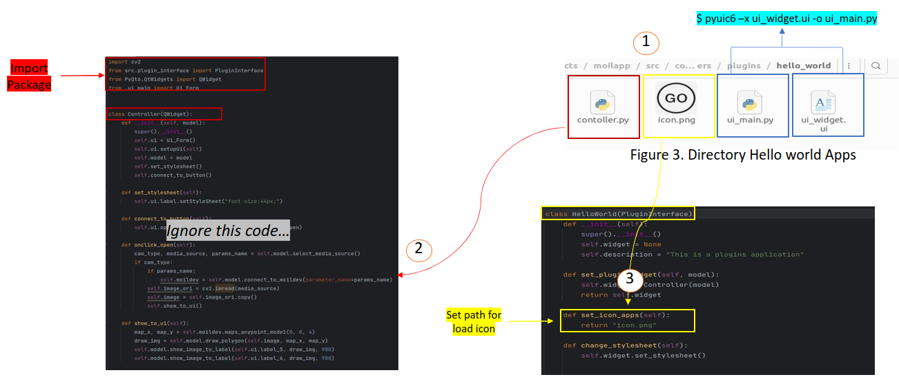
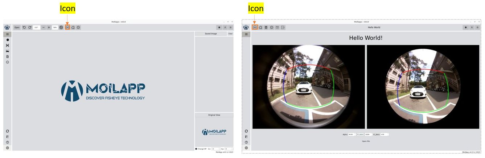

Develop applications
####################

Design User Interface
======================

    To design user interface, following this steps.

- Install Qt Designer

.. code-block:: bash

    $ sudo apt update

    $ sudo apt install build-essential

    $ sudo apt install qtcreator

    $ sudo apt install qt5-default

    $ sudo apt-get install qt5-doc qtbase5-examples qtbase5-doc-html

   Open Qt Designer

- Select Widget type -> create

   create widget

   design user interface in Qt

Add an Icon on Moilapp Plugin
==============================

- Prepare an Icon on directory

- Import package in Class "Controller"

- In Class “Hello World(PluginInterface)” -> Create function to add Icon

   import package & class controller

Show Hello World application
=============================

   hello world apps

