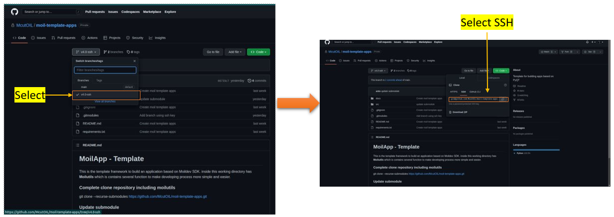

Clone using git SSH
###################

Configuration SSH
=================

SSH configuration for Git involves setting up SSH keys and configuring the SSH client to establish secure connections with Git servers.
It enables users to authenticate themselves securely without the need for passwords, providing a seamless and efficient workflow. Follow this steps:

- Open terminal on computer

- Typing “ssh-keygen –t rsa” -> typing y and enter to continue.

   configuration ssh-keygen

- Typing “cat .ssh/id_rsa.pub” -> enter to continue.

- Showing the ssh-code

   SSH-Code

Open Setting Your GitHub
========================

- See top over right on your GitHub

- Click “Setting” to open

.. figure:: assets/3a.png
   :scale: 80 %
   :alt: alternate text
   :align: center

   setting configuration

- Find SSH and GPG Key

- Click “New SSH Key” to create

.. figure:: assets/4a.png
   :scale: 80 %
   :alt: alternate text
   :align: center

   Create SSH

Create SSH Keys
================

- Typing title ssh, for example “ssh-git”

- Copy your ssh-code (before you create on terminal)

- Click add SSH Key

.. figure:: assets/5a.png
   :scale: 80 %
   :alt: alternate text
   :align: center

   SSH Keygen

Clone Repository
=================

- Open Repository “moil-template-apps”

- Select branch “v4.0 ssh”

- Copy link to clone

   copy link SSH

Open terminal on computer

Typing “git clone –recurse-submodule “link_repository” --branch=v4.0 ssh. -> enter

   command using "-recurse-submodule"

Check result clone in dir
==========================

- Check Repository

- Check submodule

.. figure:: assets/8a.png
   :scale: 80 %
   :alt: alternate text
   :align: center

   Repository/submodule

