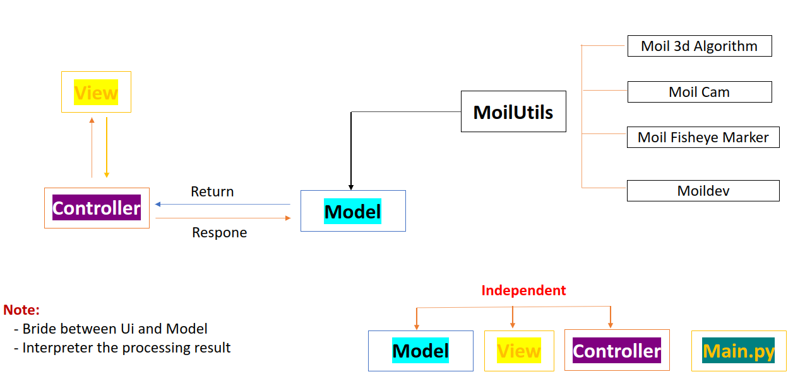
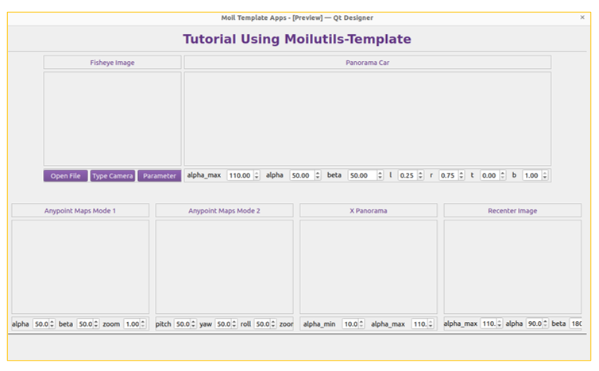
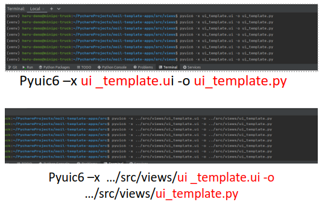
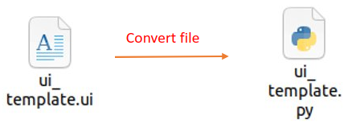
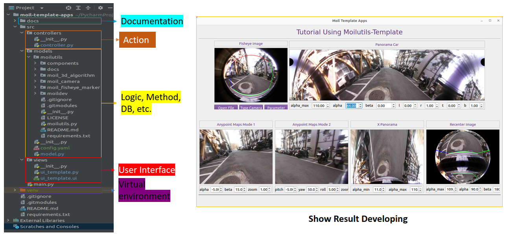

MoilUtils Template
###################

Structure Development Apps
==========================

Before developing an application using the moilutils-template, it is beneficial to have a clear understanding of the concept
behind the MVC (Model-View-Controller) model that is applied in the development of this application. This understanding will facilitate the development process and make it easier to build the application.

   Structure mvc model

Design User Interface
======================

First, we create a user interface design using PyQt6 Design to meet specific needs and desired style. For this particular design,
for the example. I have created a simple yet versatile user interface that incorporates methods for fisheye camera implementation.

   Result design user interface

following this command to convert ui file to python file

   Result design user interface

   convert ui to python file

Developing using PyCharm
=========================

The directory structure in the tree directory reflects the implementation of the MVC model and promotes efficient understanding, modification, and advanced development.
If you take a closer look, you will notice the "docs" folder, which provides tutorials and documentation to assist you in developing applications using the moilutils-template. This folder serves as a valuable resource for guidance and reference throughout the development process.

   Result of development

